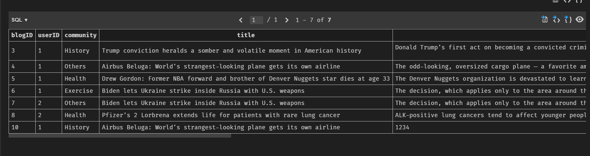
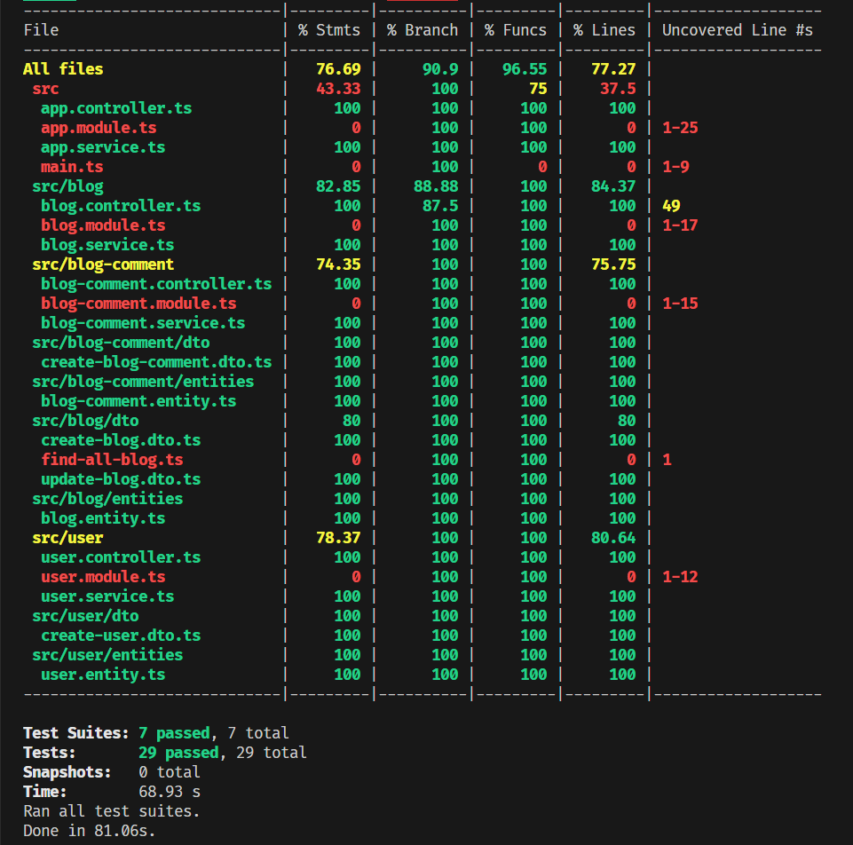

<p align="center">
  <a href="http://nestjs.com/" target="blank"></a>
</p>

## Installation

```bash
$ yarn install

```

## Installation Extensions

Open Extensions ``(Ctrl + Shift + X)``

Search ``SQLite`` and Install


Open Database SQLite ``(Ctrl + Shift + P)``

Search ``SQLite: Open Data Database`` and Click


Choose ``a-board-api/database.sqlite``


SQLite Explorer will Show


Click ``show table`` to see results table



## Running the app

```bash
# development
$ yarn run start

# watch mode
$ yarn run start:dev

# production mode
$ yarn run start:prod
```

To Visit App:
Open [http://localhost:5000](http://localhost:5000) with your browser to see the result.

## Test

```bash
# unit tests
$ yarn run test

# e2e tests
$ yarn run test:e2e

# test coverage
$ yarn run test:cov
```


## API Document

Method |API Path | Params | Query | Body | Response
----- | ----- | ----- | ----- | ----- | ----- |
POST | user | - | - | - | status 201 |
GET | user:id | id: string | - |{"username": "Sam"}| {"id": 1, "username": "Worada"} |
GET | blog:blogID | blogID: string  | - | - | { "blogID": 1, "userID": "", "community": "", "title": "","description": ""} <br>See more below. |
GET | blog | - | userID?: string,community?: string, search?: string: string | - | { "blogID": 3, "userID": 1, "community": "","title": "","description": "","username": "","comments": [{"blogCommentID": 3,"blogID": 3,"userID": 1,"comment": "","username": ""}]} <br>See more below. |
POST | blog:blogID | - | userID?: string, community?: string |{"userID":2,"community": "Food", "title":"History 3", "description": ""} | status 201 |
PATCH | blog:blogID | blogID: string | userID?: string, community?: string |{ "userID" :1, "community": "community","title":"title 2", "description":"description"} | status 200 |
DELETE | blog:blogID | blogID: string| - | - | status 200 |
POST | blog-comment | - | - |{"blogID": 1,"userID": 1, "comment": ""} | status 201 |


### GET user:id
```json
// Response
{
    "id": 1,
    "username": "Worada"
}
```

### GET blog:blogID
```json
// Response
{
    "blogID": 5,
    "userID": 1,
    "community": "Health",
    "title": "Drew Gordon: Former NBA forward and brother of Denver Nuggets star dies at age 33",
    "description": "The Denver Nuggets organization is devastated to learn about the tragic passing of Drew Gordon,” the team posted on X, formerly known as Twitter. “Drew was far too young to leave this world, but his legacy will forever live on through his three beautiful children and all of his loved ones,” the statement added.",
    "username": "Worada",
    "comments": [
        {
            "blogCommentID": 7,
            "blogID": 5,
            "userID": 1,
            "comment": "Still, “this is the best long-term data we’ve ever seen for” this class of drugs, she said. “This is just the most impressive progression-free survival we’ve ever seen in this population.”",
            "username": "Worada"
        }
    ]
}
```

### GET blog
```json
// Response
[
  {
        "blogID": 3,
        "userID": 1,
        "community": "History",
        "title": "Trump conviction heralds a somber and volatile moment in American history",
        "description": "Donald Trump’s first act on becoming a convicted criminal was to launch a raging new attack on the rule of law, laying bare the gravity of the choice awaiting America’s voters.\n\n",
        "username": "Worada",
        "comments": [
            {
                "blogCommentID": 3,
                "blogID": 3,
                "userID": 1,
                "comment": "There is one caveat: The drug that Lorbrena was compared to, crizotinib, is no longer used in the U.S., said Dr. Julie Gralow, the chief medical officer and executive vice president at the American Society of Clinical Oncology.",
                "username": "Worada"
            },
            {
                "blogCommentID": 4,
                "blogID": 3,
                "userID": 1,
                "comment": "“In an ideal world, we would have compared lorlatinib to one of those, but the study was started before those were approved,” Gralow said. ",
                "username": "Worada"
            },
            {
                "blogCommentID": 5,
                "blogID": 3,
                "userID": 1,
                "comment": "Still, “this is the best long-term data we’ve ever seen for” this class of drugs, she said. “This is just the most impressive progression-free survival we’ve ever seen in this population.”",
                "username": "Worada"
            },
            {
                "blogCommentID": 8,
                "blogID": 3,
                "userID": 1,
                "comment": "The afterlife sitcom The Good Place comes to its culmination, the show’s two protagonists, Eleanor and Chidi, contemplate their future. Having lived thousands upon thousands of lifetimes together, and having experienced virtually everything this life has to offer, they are weary. It is time for it all to end. The show’s solution to this perpetual happiness-cum-weariness is extinction. When you have had enough, when you are utterly sated by love and joy and pleasure, you can walk through a passage to nothingness. And Chidi has had enough.",
                "username": "Worada"
            },
            {
                "blogCommentID": 9,
                "blogID": 3,
                "userID": 1,
                "comment": "The afterlife sitcom The Good Place comes to its culmination, the show’s two protagonists, Eleanor and Chidi, contemplate their future. Having lived thousands upon thousands of lifetimes together, and having experienced virtually everything this life has to offer, they are weary. It is time for it all to end. The show’s solution to this perpetual happiness-cum-weariness is extinction. When you have had enough, when you are utterly sated by love and joy and pleasure, you can walk through a passage to nothingness. And Chidi has had enough.",
                "username": "Worada"
            }
        ]
    },
    {
        "blogID": 4,
        "userID": 1,
        "community": "Others",
        "title": "Airbus Beluga: World’s strangest-looking plane gets its own airline",
        "description": "The odd-looking, oversized cargo plane — a favorite among planespotters around the world — has been in service for close to two decades. It mainly transports aircraft parts between Airbus’ manufacturing facilities spread throughout Europe.",
        "username": "Worada",
        "comments": [
            {
                "blogCommentID": 6,
                "blogID": 4,
                "userID": 1,
                "comment": "Still, “this is the best long-term data we’ve ever seen for” this class of drugs, she said. “This is just the most impressive progression-free survival we’ve ever seen in this population.”",
                "username": "Worada"
            }
        ]
    },
    {
        "blogID": 5,
        "userID": 1,
        "community": "Health",
        "title": "Drew Gordon: Former NBA forward and brother of Denver Nuggets star dies at age 33",
        "description": "The Denver Nuggets organization is devastated to learn about the tragic passing of Drew Gordon,” the team posted on X, formerly known as Twitter. “Drew was far too young to leave this world, but his legacy will forever live on through his three beautiful children and all of his loved ones,” the statement added.",
        "username": "Worada",
        "comments": [
            {
                "blogCommentID": 7,
                "blogID": 5,
                "userID": 1,
                "comment": "Still, “this is the best long-term data we’ve ever seen for” this class of drugs, she said. “This is just the most impressive progression-free survival we’ve ever seen in this population.”",
                "username": "Worada"
            }
        ]
    },
]
```
